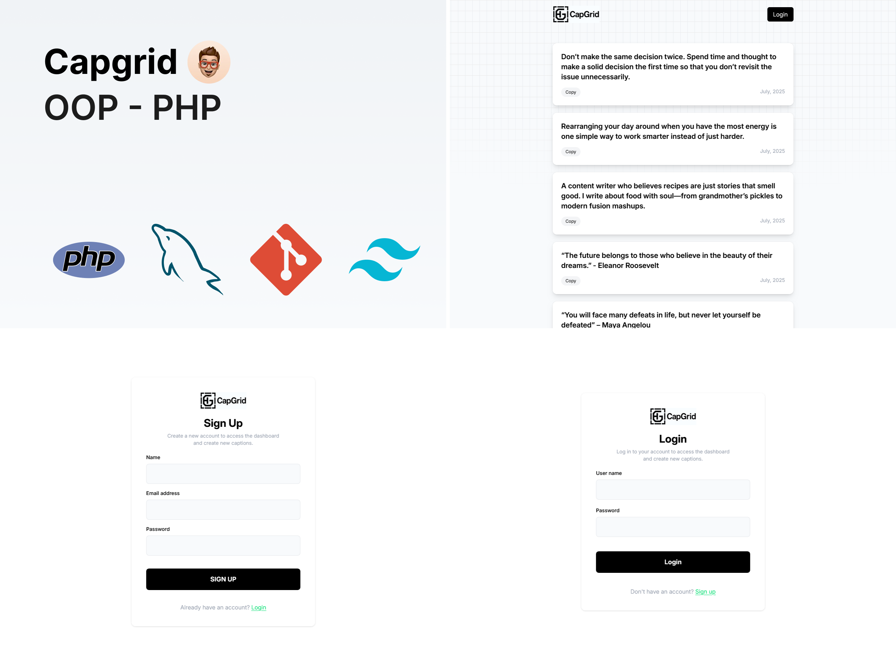

# Capgrid - OOP PHP Caption CRUD 🧾

**Capgrid** is a simple, clean web application built with **Object-Oriented PHP** for practicing modern PHP development principles. This CRUD-based system allows users to register, log in, and manage captions that are visible to all users.

> 🔗 Live Preview: [capgrid.suvroweb.com](https://capgrid.suvroweb.com/)

---

## 📌 Features

- ✅ **User Authentication**
  - Secure registration and login system
- ✍️ **Caption Management**
  - Create, read, update, and delete captions (CRUD)
  - Captions are publicly visible
- 👤 **User Profile**
  - Update basic user information
- 🔒 Session-based access control

---

## 🚀 Tech Stack

- **Language:** PHP (OOP)
- **Database:** MySQL
- **Frontend:** HTML5, CSS3, Tailwind CSS
- **Architecture:** MVC-style structure (manual implementation)

---

## 📁 Project Structure

```
capgrid/
│
├── config/           # DB connection and configuration, PHP classes (User, Caption, DB, etc.) 
├── db/               # Database sql file and sql script
├── /                 # Accessible files (index.php, login, register)
├── includes/         # Reusable layouts (header, footer)
├── uploads/          # Profile images (if implemented)
└── README.md         # Project overview
```

---

## ⚙️ Setup Instructions

1. **Clone the repository**
   ```bash
   git clone https://github.com/yourusername/capgrid.git
   cd capgrid
   ```

2. **Import the database**
   - Use `capgrid.sql` from the project (if available) to set up the database in your local server (e.g., phpMyAdmin or MySQL CLI).

3. **Configure database connection**
   - Update your DB credentials in `/config/config.inc.php`:
     ```php
     $this->servername = "localhost";
     $this->username = "root";
     $this->password = "";
     $this->dbname = "capgrid";
     ```

4. **Run the project locally**
   - Use `http://localhost/capgrid/` if using XAMPP, MAMP, etc.

---

## 📸 Screenshots

### 🖥️ Dashboard View


### ✏️ Edit Caption View


---

## 📄 License

This project is open-source and free to use for learning and development purposes.

---

## 🙌 Acknowledgements

Created by **Shuvro Dev** for practicing PHP Object-Oriented Programming and CRUD operations.

---

Feel free to fork or contribute to enhance this beginner-friendly project.
